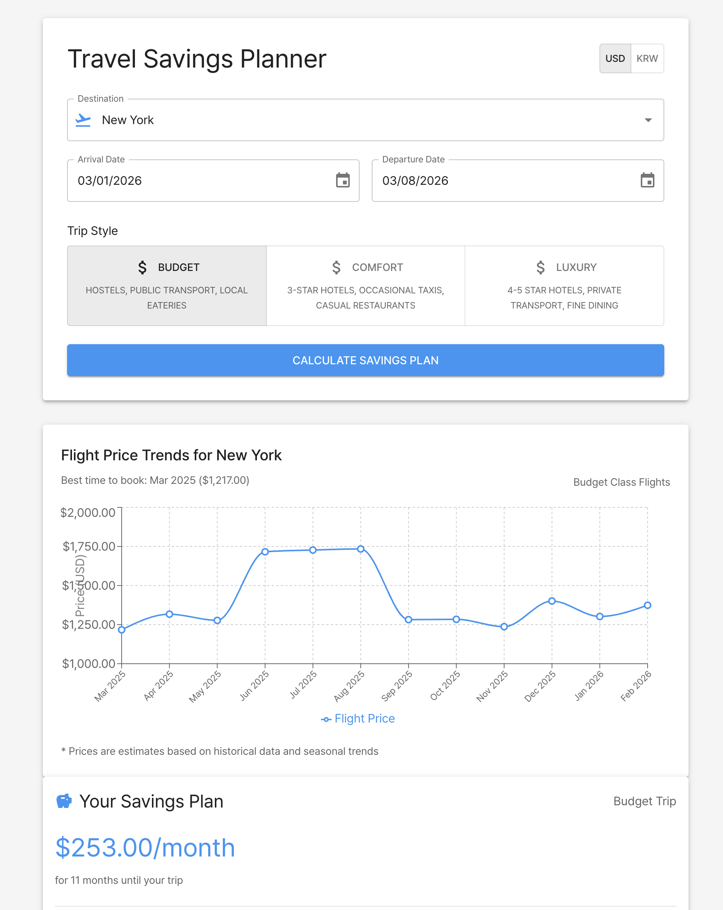

# Travel Savings Planner | 여행 저축 플래너

[English](#english) | [한국어](#korean)

---

<a name="english"></a>
## 🌏 Travel Savings Planner

A smart travel savings calculator that helps you plan and save for your next trip. Designed to integrate with TOSS for automated savings goals.

### Features

- **Destination Planning**
  - Choose from popular destinations
  - View seasonal price trends
  - Get flight price forecasts

- **Trip Style Options**
  - Budget: Hostels, public transport, local eateries
  - Comfort: 3-star hotels, mixed transport, casual restaurants
  - Luxury: 4-5 star hotels, private transport, fine dining

- **Smart Cost Calculation**
  - Automatic monthly savings calculation
  - Detailed cost breakdown
  - Seasonal price adjustments
  - Currency support (USD/KRW)

- **Travel Cost Breakdown**
  - Flight costs
  - Accommodation expenses
  - Food and dining
  - Activities and attractions

### Technology Stack

- React.js
- Material-UI (MUI)
- Recharts for data visualization
- date-fns for date handling

### Getting Started

1. Clone the repository
```bash
git clone [repository-url]
```

2. Install dependencies
```bash
npm install
```

3. Start the development server
```bash
npm start
```

4. Open [http://localhost:3000](http://localhost:3000) in your browser

---

<a name="korean"></a>
## 🌏 여행 저축 플래너

다음 여행을 위한 저축을 계획하고 관리할 수 있는 스마트 여행 저축 계산기입니다. TOSS와 연동하여 자동 저축 목표를 설정할 수 있도록 설계되었습니다.

### 주요 기능

- **여행지 계획**
  - 인기 여행지 선택
  - 계절별 가격 동향 확인
  - 항공권 가격 예측

- **여행 스타일 옵션**
  - 절약형: 호스텔, 대중교통, 현지 식당
  - 일반형: 3성급 호텔, 혼합 교통수단, 일반 레스토랑
  - 럭셔리형: 4-5성급 호텔, 전용 교통, 고급 레스토랑

- **스마트 비용 계산**
  - 월별 저축 금액 자동 계산
  - 상세 비용 분석
  - 계절별 가격 조정
  - 통화 지원 (USD/KRW)

- **여행 비용 분석**
  - 항공권 비용
  - 숙박 비용
  - 식비
  - 관광 및 액티비티

### 기술 스택

- React.js
- Material-UI (MUI)
- Recharts (데이터 시각화)
- date-fns (날짜 처리)

### 시작하기

1. 저장소 클론
```bash
git clone [repository-url]
```

2. 의존성 설치
```bash
npm install
```

3. 개발 서버 실행
```bash
npm start
```

4. 브라우저에서 [http://localhost:3000](http://localhost:3000) 열기

---

### Future Updates | 향후 업데이트

🇺🇸 **Upcoming Features**
- TOSS API integration for automatic savings
- More destinations and travel styles
- Real-time flight price tracking
- Personalized travel recommendations
- Mobile app version

🇰🇷 **예정된 기능**
- TOSS API 연동을 통한 자동 저축
- 더 많은 여행지와 여행 스타일 추가
- 실시간 항공권 가격 추적
- 개인 맞춤형 여행 추천

---

### Screenshots | 스크린샷

<div align="center">
  <h4>Main Dashboard | 메인 대시보드</h4>
  
</div>

#### Features Shown in Screenshot | 스크린샷에 표시된 기능
🇺🇸
- Interactive trip style selection
- Dynamic flight price trends chart
- Detailed cost breakdown
- TOSS integration for savings goals
- Currency selection (USD/KRW)

🇰🇷
- 대화형 여행 스타일 선택
- 실시간 항공권 가격 동향 차트
- 상세 비용 분석
- TOSS 연동 저축 목표 설정
- 통화 선택 (USD/KRW)

---

### License | 라이선스

MIT License | MIT 라이선스 